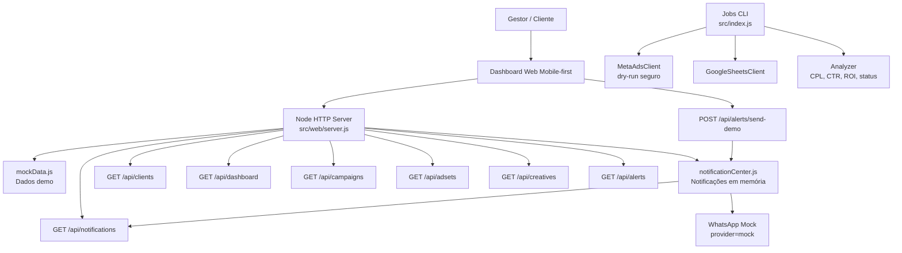
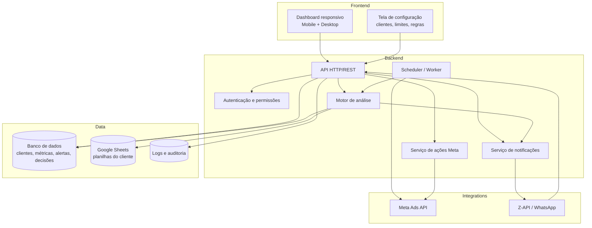
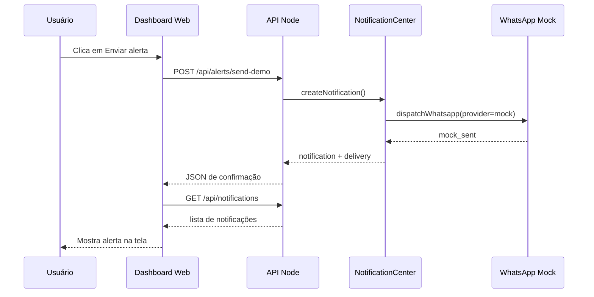
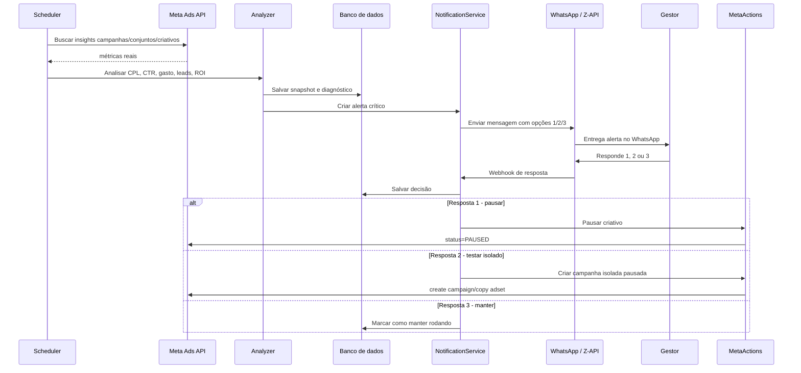
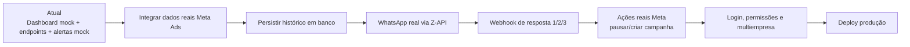

# Arquitetura UML — Tráfego Automator

Este documento mostra o estado atual do projeto e o caminho de evolução para produto real com Meta Ads, Google Sheets, WhatsApp e dashboard em tempo real.

## 1. Estado atual — MVP demonstrável sem APIs reais

## 2. Arquitetura alvo — produto completo em produção

## 3. Sequência atual — alerta em tempo real mock

## 4. Sequência futura — alerta real + decisão pelo WhatsApp

## 5. Modelo conceitual de domínio

```mermaid
classDiagram
  class Client {
    +key
    +name
    +mode
    +spreadsheetId
    +adAccountId
    +rules
  }

  class Campaign {
    +id
    +name
    +objective
    +spend
    +leads
    +cpl
    +ctr
    +roi
    +status
  }

  class AdSet {
    +id
    +campaignId
    +name
    +spend
    +leads
    +cpl
    +ctr
    +status
  }

  class Creative {
    +id
    +adSetId
    +name
    +spend
    +leads
    +cpl
    +ctr
    +statusAnalise
    +recommendation
  }

  class Alert {
    +id
    +clientId
    +type
    +severity
    +message
    +action
    +status
  }

  class Notification {
    +id
    +channel
    +provider
    +status
    +sentAt
    +message
  }

  class Decision {
    +id
    +notificationId
    +reply
    +interpretedAction
    +createdAt
  }

  Client "1" --> "many" Campaign
  Campaign "1" --> "many" AdSet
  AdSet "1" --> "many" Creative
  Creative "1" --> "many" Alert
  Alert "1" --> "many" Notification
  Notification "1" --> "0..1" Decision
```

## 6. Roadmap técnico

## 7. Priorização sugerida

1. Manter demo/mock funcionando para apresentação.
2. Ligar dashboard aos jobs internos, ainda sem banco.
3. Criar camada de persistência simples.
4. Plugar Meta Ads API real.
5. Plugar Z-API real.
6. Criar webhook de resposta do WhatsApp.
7. Ativar ações reais apenas com confirmação e logs.
